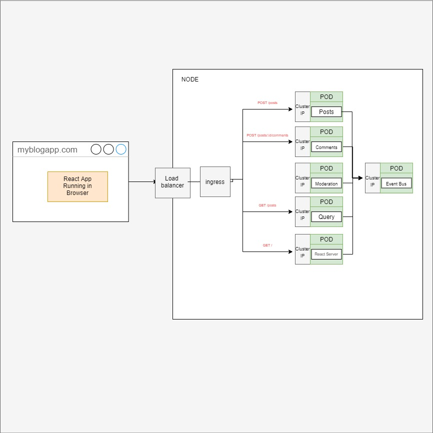

# Micro-Services Blog

A Super simple micro blog that is built with a micro-services architecture.

## Motivation

I wanted to learn how to break features and services down into microservices and have them communicate with one another using an event-bus. 

## The Microservices Architecture

## Tech/Framework Used

Build with:
* REACT.js
* Bootstrap
* Node.js
* Docker
* Kubernetes
* Skaffold

## Features

* Posts: Create a Post
* Comments: Add a comment to a post
* Content Moderation: Comments are moderated. If a comment contains the word Orange, it will be rejected.
* Event syncing: If the query service goes down, it will look for any missed events when it starts back up again.

## Requirements

* Docker for desktop
* Node.js 
* NGINX Ingress Controller

## Installation

The installation instructions given are for Windows 10, using Docker for desktop.

1. Fork and clone: 

    `git clone https://github.com/BrandedNomad/microservices-blog.git`

2. Update hosts configuration to map the domain to localhost.

    * navigate to: C:\Windows\System32\drivers\etc\hosts 
    * open the hosts configuration file
    * at the very end add the following

    `127.0.0.1 myblogapp.com`

3. Install NGINX Ingress Controller

    `kubectl apply -f https://raw.githubusercontent.com/kubernetes/ingress-nginx/controller-v0.46.0/deploy/static/provider/cloud/deploy.yaml`

4. Ensure Docker and k8 Engine is running.

5. Install Skaffold

    `choco install skaffold`

6. CD into the project's root directory and run Skaffold in the terminal.

    `skaffold dev`

    Skaffold will take care of building the docker images, and deploying them to a k8 cluster. The first time around might take a few minutes to startup as Skaffold will build the individual docker images. NOTE: The first time you run skaffold, it might fail to deploy the images to a k8 cluster, this is usaully easily sovled by simply running the skaffold command again.

7. Confirm all K8 pods are running

    `kubectl get deployments`

8. Navigate to myblogapp.com in your browser

## How To Use It

1. Type in a post title and press submit
2. Refresh the browser to see post
3. Add comment to post and press submit 
4. refresh browser to see comment
5. Add a comment with the word 'Orange' in it, to see the comment rejected
6. To see the event syncing in action, terminate the moderation pod and then create another comment on an existing post, refresh the browser and it will say 'pending'. Then restart the moderation service, refresh the browser again, and you will see the comment has been moderated.

## Credit

This project is a part of the [Microservices with Node and React](https://www.udemy.com/course/microservices-with-node-js-and-react/) course. I highly recommend checking out this course if you want to learn more about microservices architecture.

## License

MIT License

Copyright (c) 2021 Charl Swart

Permission is hereby granted, free of charge, to any person obtaining a copy
of this software and associated documentation files (the "Software"), to deal
in the Software without restriction, including without limitation the rights
to use, copy, modify, merge, publish, distribute, sublicense, and/or sell
copies of the Software, and to permit persons to whom the Software is
furnished to do so, subject to the following conditions:

The above copyright notice and this permission notice shall be included in all
copies or substantial portions of the Software.

THE SOFTWARE IS PROVIDED "AS IS", WITHOUT WARRANTY OF ANY KIND, EXPRESS OR
IMPLIED, INCLUDING BUT NOT LIMITED TO THE WARRANTIES OF MERCHANTABILITY,
FITNESS FOR A PARTICULAR PURPOSE AND NONINFRINGEMENT. IN NO EVENT SHALL THE
AUTHORS OR COPYRIGHT HOLDERS BE LIABLE FOR ANY CLAIM, DAMAGES OR OTHER
LIABILITY, WHETHER IN AN ACTION OF CONTRACT, TORT OR OTHERWISE, ARISING FROM,
OUT OF OR IN CONNECTION WITH THE SOFTWARE OR THE USE OR OTHER DEALINGS IN THE
SOFTWARE.
